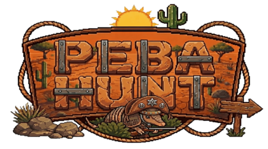

<div align="center">
  
  <h1>Peba Hunt</h1>
</div>

> **Projeto Educacional:** Este jogo é meramente fictício e desenvolvido para fins acadêmicos. Não incentivamos a caça de animais silvestres.

**Peba Hunt** é um jogo de tiro ao alvo 2D estilo *arcade* ambientado no sertão nordestino. O projeto foi desenvolvido inteiramente em **Linguagem C** utilizando a biblioteca gráfica **Allegro 5**.

O objetivo do jogador é acertar os tatus ("pebas") que aparecem aleatoriamente na tela antes que o tempo acabe ou a munição se esgote.

---

## Funcionalidades

- **Menu Interativo:** Navegação completa com mouse (Novo Jogo, Créditos, Sair).
- **Sistema de Mira:** Cursor personalizado para o jogo.
- **Mecânicas de Jogo:**
  - Sistema de munição limitada.
  - Temporizador de fase.
  - Contagem de pontuação e combos.
  - Colisão precisa (Hitbox) ajustada aos sprites.
- **Máquina de Estados:** Transição fluida entre Menu, Jogo, Pause e Tela de Créditos.
- **Áudio e Gráficos:** Sprites animados e trilha sonora temática.

---

## Tecnologias Utilizadas

- **Linguagem C**
- **Biblioteca Allegro 5**
- **Git/GitHub** 


## Como Rodar o Jogo

### Pré-requisitos
Você precisa ter o compilador **GCC** e as bibliotecas de desenvolvimento do **Allegro 5** instaladas no seu sistema.

#### No Linux (Ubuntu/Debian):
```bash
sudo apt-get install build-essential git
sudo apt-get install liballegro5-dev

**Clone o repositorio**
git clone [https://github.com/Rogerllc/PebaHunt.git](https://github.com/Rogerllc/PebaHunt.git)
cd PebaHunt

**Compile o codigo: Utilizando o comando a baixo**
gcc jogo.c -o jogo -lallegro -lallegro_image -lallegro_primitives -lallegro_font -lallegro_ttf -lallegro_audio -lallegro_acodec -lm

**Execute  jogo**
./jogo
```
## Desenvolvedores
- **Projeto desenvolvido para a disciplina de Algoritmos e Estrutura de Dados I (2025.1).**
- **Gustavo Morais - Sprites e Arte**
- **Wagner Junior - Sprites e Arte**
- **Luan Jefferson - Lógica do Jogo**
- **Roger Leite - Interface (UI) e Integração**
